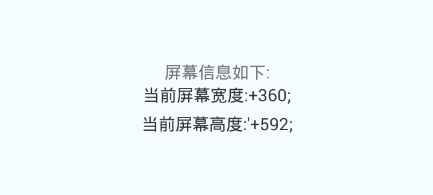

# React Native API模块 之 Dimensions


## Dimensions

Dimensions  屏幕宽高模块

(一)方法

1.set(dims:{[key:string]:any})  static 静态方法，该方法应该只能被原生代码进行调用。@parm{object} dims参数作为屏幕宽高设置

2.get(dim:string)   static静态方法,进行初始化屏幕的宽和高信息 在runApplication方法之后就执行了，所以我们可以在任何requires的方法运行之前就可以获取到该信息。不过该信息可能会发生改变。具体我们往下看:

[注].屏幕尺寸信息一般可以直接进行使用的，但是有时候会发生变化(例如:屏幕的方向发生旋转)。因此如果基于该屏幕信息的业务逻辑或者相关样式设置需要在调用每次render渲染方法之后进行，而不是我们把该屏幕信息保存下来，后面直接使用。(例如:我在使用样式设置的时候，不要去使用StyleSheet方法，而是采用内联式方案)。即:什么时候需要使用屏幕信息，那就什么时候去调用该方法

实例代码:var {height,width}=Dimensions.get('window')

@param {string}  进行调用set方法，想要返回屏幕信息的名称

@return {Object?}  返回的屏幕尺寸信息

(二)具体事例

下面演示一下该方法的具体使用来获取屏幕的宽度和高度,具体代码如下:

```
'use strict';
import React, {
  AppRegistry,
  Component,
  StyleSheet,
  Text,
  View,
  Dimensions,
} from 'react-native';
 
class DimensionsDemo extends Component {
  render() {
    return (
      <View style={styles.container}>
        <Text style={styles.welcome}>
          屏幕信息如下:
        </Text>
        <Text style={styles.instructions}>
           当前屏幕宽度:+{Dimensions.get('window').width};
        </Text>
        <Text style={styles.instructions}>
           当前屏幕高度:'+{Dimensions.get('window').height};
        </Text>
      </View>
    );
  }
}
const styles = StyleSheet.create({
  container: {
    flex: 1,
    justifyContent: 'center',
    alignItems: 'center',
    backgroundColor: '#F5FCFF',
  },
  instructions: {
    textAlign: 'center',
    color: '#333333',
    marginBottom: 5,
  },
});
 
AppRegistry.registerComponent('DimensionsDemo', () => DimensionsDemo);
```

运行截图如下:




[全文完]