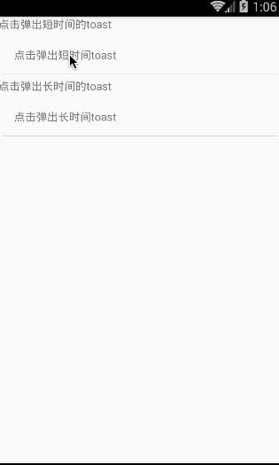

# React Native API模块 之 StyleSheet


## StyleSheet

在React Native中，该StyleSheet模块是实现了类似Web中CSS样式表的功能。简单的创建一个StyleSheet文件的实例代码如下:

```
const styles = StyleSheet.create({
  container: {
    borderRadius: 4,
    borderWidth: 0.5,
    borderColor: '#d6d7da',
  },
  title: {
    fontSize: 19,
    fontWeight: 'bold',
  },
  activeTitle: {
    color: 'red',
  },
});

<View style={styles.container}>
  <Text style={[styles.title, this.props.isActive && styles.activeTitle]} />
</View>
```

这样写的方式，有以下一些优点:

1.从代码质量角度来分析:

- 从render渲染方法中移除了styles样式相关代码，这样可以使代码更加容易阅读
- 通过对不同样式命名，正好也是对render方法中的组件的一种标志

2.从性能角度来分析:

- 通过StyleSheet，我们可以通过标志的样式ID来引用，而不是每次都要创建一个新的Style对象
- 该允许样式通过桥接在原生代码和JavaScript中传递一次，后面全部通过该id进行引用(不过现在该功能还没有实现)


方法

create(obj:{[key:string]:any})  static 静态方法   通过给定的对象进行常见一个StyleSheet样式

三)属性

1.hairlineWidth:CallExpression  该用来定义当前平台最细的宽度。该属性用来设置边框或者两个组件之间的分割线。例如:

```
{
    borderBottomColor: '#bbb',
    borderBottomWidth: StyleSheet.hairlineWidth
}
```

该会根据当前平台信息，自动转换成一根很细的线。

2.flatten: CallExpression


## ToastAndroid

模块:ToastAndroid。android平台的toast消息。

该ToastAndroid模块是把Android平台原生模块Toast封装成一个JS模块使用，来进行弹出一个toast消息。该模块有一个'show'方法会传入下面两个参数:①:message  string 字符串格式，设置要进行toast显示的文本    ②:duration  int格式 toast消息弹出显示的时长。有两个可选值ToastAndroid.SHORT或者ToastAndroid.LONG

(二)方法

1.show(message:string,duration:number)  static 静态方法，该设置toast消息的弹出

(三)属性

1.SHORT  静态int值，表示toast显示较短的时间

2.LONG   静态int值，表示otast显示较长的时间

(四)使用实例

ToastAndroid具体代码如下:

```
'use strict';
import React, {
  AppRegistry,
  Component,
  StyleSheet,
  Text,
  View,
  ToastAndroid,
  TouchableHighlight,
} from 'react-native';
class CustomButton extends React.Component {
  render() {
    return (
      <TouchableHighlight
        style={styles.button}
        underlayColor="#a5a5a5"
        onPress={this.props.onPress}>
        <Text style={styles.buttonText}>{this.props.text}</Text>
      </TouchableHighlight>
    );
  }
}
class ToastAndroidDemo extends Component {
  render() {
    return (
      <View>
        <Text style={styles.welcome}>
          点击弹出短时间的toast
        </Text>
        <CustomButton text="点击弹出短时间toast"
        onPress={()=>ToastAndroid.show('点击我好疼,短时间的~',ToastAndroid.SHORT)}/>
        <Text style={styles.welcome}>
          点击弹出长时间的toast
        </Text>
        <CustomButton text="点击弹出长时间toast"
        onPress={()=>ToastAndroid.show('点击我好疼,长时间的~',ToastAndroid.LONG)}/>
      </View>
    );
  }
}
const styles = StyleSheet.create({
  button: {
    margin:5,
    backgroundColor: 'white',
    padding: 15,
    borderBottomWidth: StyleSheet.hairlineWidth,
    borderBottomColor: '#cdcdcd',
  }
});
 
AppRegistry.registerComponent('ToastAndroidDemo', () => ToastAndroidDemo);
```

运行截图如下:




[全文完]