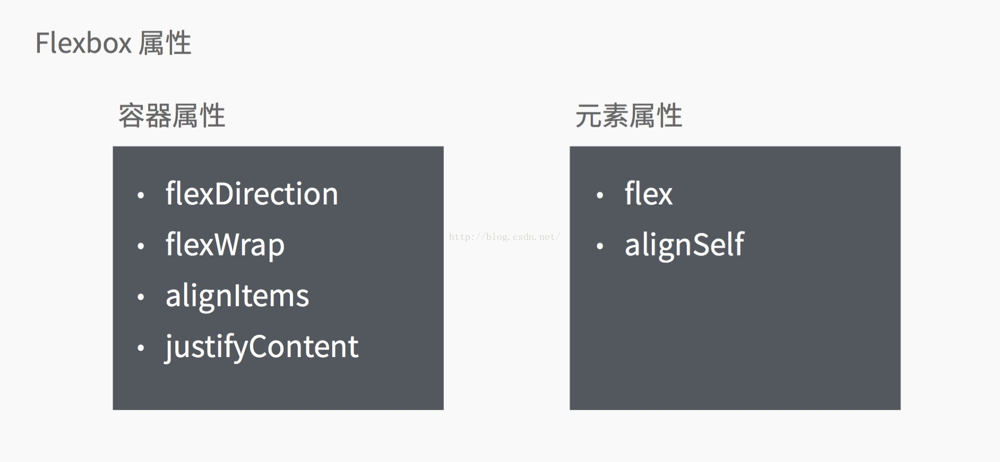
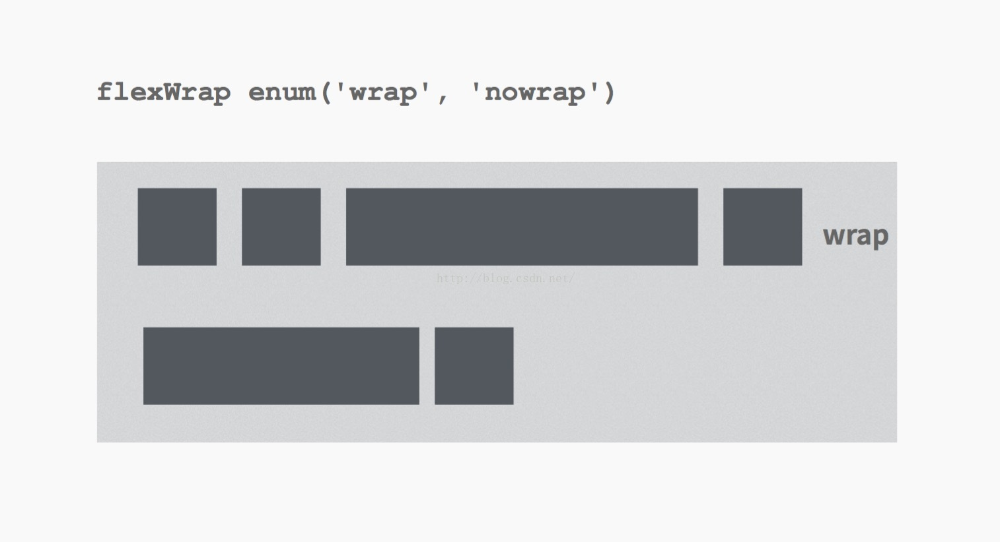

# RN布局之FlexBox

### 综述

flex是Flexible Box的缩写，意为"弹性布局"，用来为盒状模型提供最大的灵活性。采用flex布局的元素，称为flex容器（flex Container），简称"容器"。它的所有子元素自动成为容器成员，称为flex项目（flex item），简称"项目"。



### flexDirection

布局方向，决定主轴的方向，默认值是column，即纵向布局

|值             |描述                 |
|-------------|--------------------|
|row           |横向布局，主轴为水平方向|
|column     |纵向布局，主轴为竖直方向|


### flexWrap

包含内容，默认值是nowrap，不包裹所有内容，其实可以理解为是否换行。

|值           |描述                                                     |
|-----------|--------------------------------------------------------|
|nowrap  |项目沿主轴方向布局，超出容器长度的部分不可见                    |
|wrap      |项目沿主轴布局所需长度大于容器总长度时，分行布局，所有项目内容都可见|



### alignItems

交叉轴方向对齐方式，默认值flex-start，即交叉轴开端。

|值            | 描述      |
|-------------|----------|
|flex-start  | 交叉轴开端 |
|center     | 交叉轴居中 |
|flex-end  | 交叉轴末端 |


### justifyContent

主轴方向对齐方式，默认值是flex-start，即主轴的开端

|值                  | 描述                   |
|------------------|-----------------------|
|flex-start        | 主轴开端                |
|center            | 居中                   |
|flex-end         | 主轴末端                |
|space-between| 项目与项目之间插入相等空隙 |
|space-around | 项目两旁插入相等空隙      |


### flex

布局权重

|值    |描述       |
|------|----------|
|>=0 |项目占位权重|

1:0：flex=0的项目占用空间仅为内容所需空间，flex=1的项目会占据其余所有空间


在部分组件指定了height的情况下，flex是“除了height以外剩余空间”的分布比例。例如：
```
<View style={{height:100}}>
    <View style={{flex: 3}} />
    <View style={{flex: 2}} />
</View>
```

两个子View的高度分别是 60和40。

```
<View style={{height:100}}>
    <View style={{height: 50, flex: 3}} />
    <View style={{flex: 2}} />
</View>
```
两个子View的高度就分别是80(50+30)和20。


### alignSelf

项目交叉轴方向自身对齐方式

|值            |描述|
|-------------|---|
|flex-start  |开端|
|center      |居中|
|flex-end   |末端|


[全文完]